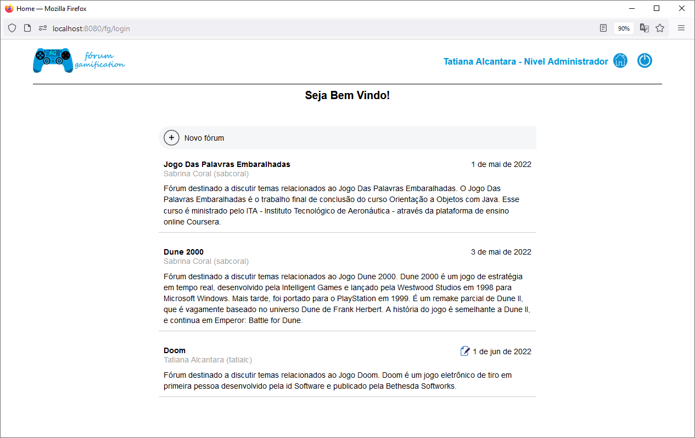

## Fórum Gamification

## Resumo
O Fórum Gamification é um projeto de **criação original** desenvolvido como trabalho final de conclusão do curso **Desenvolvimento Ágil com Java Avançado**. A aplicação consiste em um **Sistema Web de Gerenciamento de Fóruns**.

Os usuários podem cadastrar **tópicos** e **comentários**, enquanto os administradores, **tópicos**, **comentários** e novos **fóruns**.

Ao cadastrar um tópico ou comentário, o usuário ganha pontos, podendo assim, competir com os demais em um estimulante sistema de ranking.

A aplicação é organizada em camadas, seguindo o modelo **MVC**, com uma camada intermediária entre os **Servlets** e o **Banco de Dados**. O projeto utiliza um Servidor de Aplicação **JEE Apache TomCat**, que recebe as requisições, e as distribuem aos seus respectivos Servlets. Os Servlets, por sua vez, acessam a base de dados — através da camada intermediária **DAO** — e distribuem as informações às páginas **JSP**. As páginas JSP utilizam as tecnologias **TagLib** e **JSTL** para exibir as informações recebidas.

O Fórum Gamification é uma joia do teste de software que contempla Testes Unitários **JUnit**, Testes de Integração de Banco de Dados **DBUnit** e Testes de Validação do Comportamento Completo da Aplicação **E2E** com **Selenium WebDriver**.  

Para maiores informações, visite a página oficial do projeto:  
<https://togtec.dev.br/projetos/forum-gamification/resumo.php>

## Tecnologias
  * Java SE (11)
  * Maven
  * Servidor de Aplicação JEE Apache TomCat (9.0) 
  * Servlet
  * JSP
  * JDBC
  * PostgreSQL
  * JUnit 5
  * DBUnit
  * Selenium WebDriver
  
## IDE  
  * Eclipse

## Captura de tela

  

Ver galeria completa de imagens em:  
<https://togtec.dev.br/projetos/forum-gamification/imagens.php>

## Funcionalidades
1. Visitante acessa o sistema
    - Navega na lista de fóruns
    - Navega na lista de tópicos
    - Navega na lista de comentários
2. Visitante cria uma conta (define login, e-mail, nome e senha)    
3. Visitante efetua login como usuário (cadastra **tópicos** e **comentários**)
    - Ganha 10 pontos por tópico cadastrado
    - Ganha 3 pontos por comentário cadastrado
4. Visitante efetua login como administrador (cadastra **fóruns**, **tópicos** e **comentários**)
    - Ganha 10 pontos por tópico cadastrado
    - Ganha 3 pontos por comentário cadastrado
5. Usuário/administrador acessa o ranking para comparar sua posição em relação aos demais
6. Usuário/administrador edita nome e e-mail
7. Usuário/administrador redefine senha
8. Usuário/administrador efetua logout

## Executando o código localmente
1. Instalar o Servidor de Aplicação JEE **Apache TomCat**
2. Instalar a IDE Eclipse (escolher a oção: **Eclipse IDE for Enterprise Java and Web Developers**)
3. **Integrar** a IDE Eclipse ao Servidor de Aplicação Apache TomCat
4. Fazer o **download** do projeto no repositório git
5. **Importar** o projeto no Eclipse
6. **Atualizar** as dependências Mavem do Projeto
7. **Adicionar** o projeto ao Servidor de Aplicação TomCat
9. Baixar manualmente a dependência **chromedriver.exe** (WebDriver para o navegador Google Chrome — Será utilizada para rodar o teste **E2E** com **Selenium Web Driver**)
    - **obs1:** Escolher a versão do chromedriver compatível com a versão do navagador Google Chrome instalada em sua máquina
    - **obs2:** Armazenar o arquivo chromedriver.exe na pasta: D:\softDev\libraries\WebDriver\bin
10. Instalar o Banco de Dados **PostgreSQL**
11. Instalar o **pgAdmin** (plataforma de administração e gerenciamento para o banco de dados PostgreSQL)
12. Dentro do pgAdmin executar:
    - O script para a criação da **ROLE** ita
    - O script para a criação do **DATABASE** forum_gamification_db
    - O script para a criação das **TABLEs**
    - O script para a criação das **SEQUENCEs**
    - **obs1:** Os scripts se encontram no arquivo **banco_de_dados.sql**, dentro da pasta **sql**, na raiz do repositório
    - **obs2:** Os scripts devem ser executados **um por vez**, na sequência em que aparecem no arquivo   
13. Executar o projeto (escolher a opção **Run on Server**)
14. Abrir uma janela do navegador e digitar a url: **localhost:8080/fg/**

**Muito difícil?** 
Nesse caso é possível assistir ao vídeo de divulgação do projeto sem instalar nada em:  
<https://www.youtube.com/watch?v=5M9K9McJ3zg>
